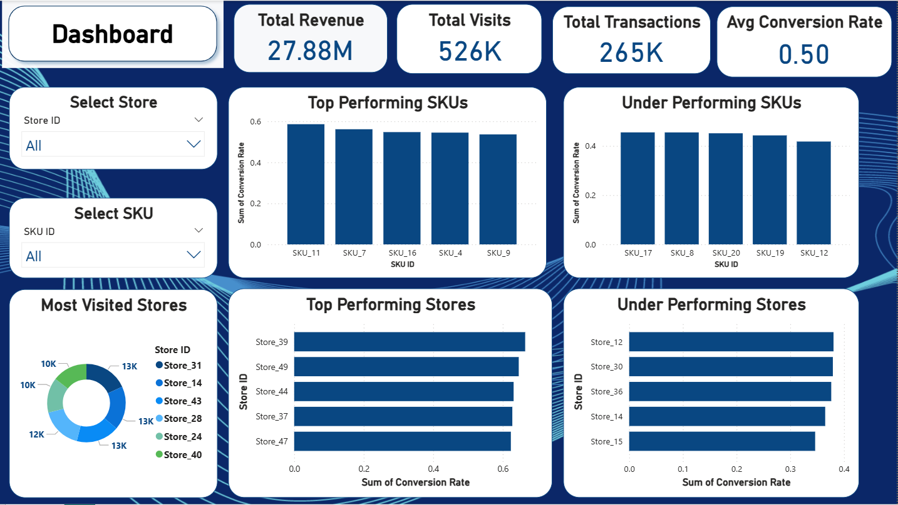

# 🛍️ Store & SKU Conversion Analysis

This project analyzes conversion trends at both the **store** and **SKU** (product) levels to identify performance patterns and propose data-driven strategies to improve sales.

---

## 📁 Dataset

The dataset includes transaction-level data for various stores and SKUs with the following features:
 
[Dataset](https://drive.google.com/file/d/1vfXAP0iPUrItvC9LEyH8yZtqYP7n2FMA/view?usp=drivesdk)

- `Store ID`
- `SKU ID`
- `Total Visits` – Number of users who visited
- `Transactions` – Number of successful purchases
- `Revenue` – Revenue generated from transactions

---

## 📊 Analysis Overview

### ✅ Key Objectives:

- Calculate conversion rates (Transactions / Total Visits) at both Store and SKU levels.
- Identify top- and bottom-performing stores and SKUs.
- Visualize conversion trends.
- Provide actionable recommendations to improve performance.

### 📈 Key Insights:

- Large variation in conversion rates between stores (from ~34% to 66%).
- Some SKUs convert nearly all visits, while others convert none.
- High visits don’t guarantee high conversions — UI/UX and product relevance matter.
  
### 🔧 Tools Used:

- **Python** (Pandas, Seaborn, Matplotlib)
- **Power BI** *(dashboard to be added below)*
- 

